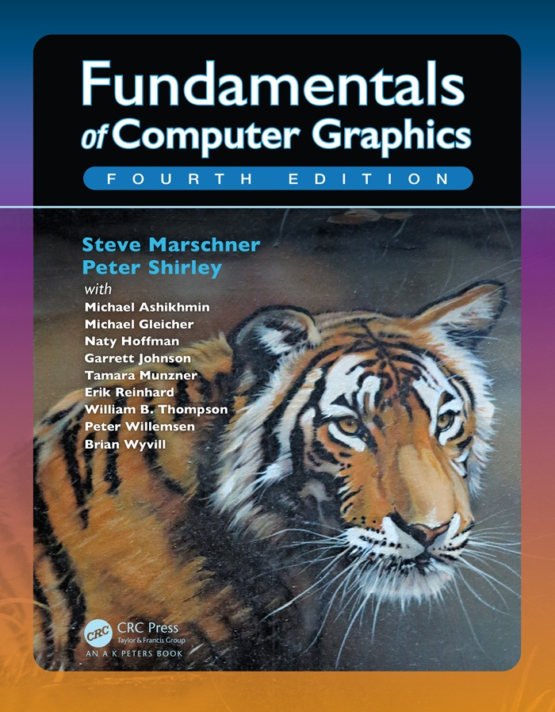

# [FundamentalsOfComputerGraphics4_Chinese](https://github.com/Sixerrr/FundamentalsOfComputerGraphics4_Chinese)

## 前言

***

Fundamentals Of Computer Graphics，计算机图形学原理。中文常称为“虎书”，是图形学之中优秀的入门书籍。

俗话说的好，看了目录就是会了(。另外寻求翻译图形学相关资料的同好，一起学习，一起进步，加入我们翻译小分队~

## 封面

***

## 概览

***
### 1 介绍(Introduction)
#### 1.1 图形领域(Graphics Areas)
#### 1.2 主要应用(Major Applications)
#### 1.3 图形API(Graphics APIs)
#### 1.4 图形管线(Graphics Pipeline)
#### 1.5 数值问题(Numerical Issues)
#### 1.6 效能(Efficiency)
#### 1.7 设计和编码图形程序(Designing and Coding Graphics Programs)
### 2 各种各样的数学(Miscellaneous Math)
#### 2.1 设置和映射(Sets and Mappings)
#### 2.2 解二次方程(Solving Quadratic Equations)
#### 2.3 三角函数(Trigonometry)
#### 2.4 向量(Vectors)
#### 2.5 曲线和曲面(Curves and Surfaces)
#### 2.6 线性插值(Linear Interpolation)
#### 2.7 三角形(Triangles)
### 3 光栅化图像(Raster Images)
#### 3.1 光栅设备(Raster Devices)
#### 3.2 图像、像素和几何图形(Images, Pixels, and Geometry)
#### 3.3 RGB颜色
#### 3.4 透明度混合(Alpha Compositing)
### 4 光线追踪(Ray Tracing)
#### 4.1 基本的光线追踪算法
#### 4.2 透视(Perspective)
#### 4.3 计算视角射线(Computing Viewing Rays)
#### 4.4 光线与物体相交(Ray-Object Intersection)
#### 4.5 着色
#### 4.6 一个光线追踪程序
#### 4.7 阴影(Shadows)
#### 4.8 理想的镜面反射(Ideal Specular Reflection)
#### 4.9 历史遗留问题(Historical Notes)
### 5 线性代数(Linear Algebra)
#### 5.1 行列式(Determinants)
#### 5.2 矩阵(Matrices)
#### 5.3 计算矩阵和行列式(Computing with Matrices and Determinants)
#### 5.4 特征式和矩阵对角式(Eigenvalues and Matrix Diagonalization)
### 6 变换矩阵(Transformation Matrices)
#### 6.1 2D线性变换
#### 6.2 3D线性变换
#### 6.3 平移和仿射变换(Translation and Affine Transformations)
#### 6.4 变换矩阵的逆(Inverses of Transformation Matrices)
#### 6.5 坐标变换(Coordinate Transformations)
### 7 观察(Viewing)
#### 7.1 视图变换(Viewing Transformations)
#### 7.2 投影变换(Projective Transformations)
#### 7.3 透视投影(Perspective Projection)
#### 7.4 透视变换的一些属性(Some Properties of the Perspective Transform)
#### 7.5 视野(Field-of-View,FOV)
### 8 图形管线(The Graphics Pipeline)
#### 8.1 光栅化(Rasterization)
#### 8.2 光栅化前后的操作(Operations Before and After Rasterization)
#### 8.3 简单抗锯齿(Simple Antialiasing)
#### 8.4 剔除渲染图元提高效率(Culling Primitives for Efficiency)
### 9 信号处理(Signal Processing)
#### 9.1 数字音频：一维采样(Digital Audio: Sampling in 1D)
#### 9.2 卷积(Convolution)
#### 9.3 卷积过滤器(Convolution Filters)
#### 9.4 图像信号处理(Signal Processing for Images)
#### 9.5 采样理论(Sampling Theory)
### 10 表面着色(Surface Shading)
#### 10.1 漫反射着色(Diffuse Shading)
#### 10.2 冯氏着色(Phong Shading)
#### 10.3 艺术风格着色(Artistic Shading)
### 11 纹理映射(Texture Mapping)
#### 11.1 查询纹理值(Looking Up Texture Values)
#### 11.2 纹理坐标函数(Texture Coordinate Functions)
#### 11.3 抗锯齿纹理查询(Antialiasing Texture Lookups)
#### 11.4 纹理映射的应用(Applications of Texture Mapping)
#### 11.5 程序化3D纹理(Procedural 3D Textures)
### 12 图形数据结构(Data Structures for Graphics)
#### 12.1 三角形网格(Triangle Meshes)
#### 12.2 场景结构(Scene Graphs)
#### 12.3 空间数据结构(Spatial Data Structures)
#### 12.4 BSP树的可见度(BSP Trees for Visibility)
#### 12.5 平铺多维数组(Tiling Multidimensional Arrays)
### 13 更多的光线追踪(More Ray Tracing)
#### 13.1 透明度和折射(Transparency and Refraction)
#### 13.2 实例化(Instancing)
#### 13.3 构造立体几何(Constructive Solid Geometry)
#### 13.4 分布式光线追踪(Distribution Ray Tracing)
### 14 采样(Sampling)
#### 14.1 积分(Integration)
#### 14.2 连续概率(Continuous Probability)
#### 14.3 蒙特卡洛积分(Monte Carlo Integration)
#### 14.4 选择随机点(Choosing Random Points)
### 15 曲线(Curves)
#### 15.1 曲线(Curves)
#### 15.2 曲线属性(Curve Properties)
#### 15.3 多项式部分(Polynomial Pieces)
#### 15.4 把所有面片放在一起(Putting Pieces Together)
#### 15.5 三次曲线(Cubics
#### 15.6 逼近曲线(Approximating Curve)
#### 15.7 总结(Summary)
### 16 计算机动画(Computer Animation)
#### 16.1 动画原则(Principles of Animation)
#### 16.2 关键帧(Keyframing)
#### 16.3 变形(Deformations)
#### 16.4 角色动画(Character Animation)
#### 16.5 基于物理的动画(Physics-Based Animation)
#### 16.6 程序化技术(Procedural Techniques)
#### 16.7 对象组(Groups of Objects)
### 17 使用图形硬件(Using Graphics Hardware)
#### 17.1 硬件概述
#### 17.2 什么是图形硬件
#### 17.3 异构多处理器(Heterogeneous Multiprocessing)
#### 17.4 图形硬件变成：缓存区、状态和着色器(Graphics Hardware Programming: Buffers, State, and Shaders)
#### 17.5 状态机(State Machine)
#### 17.6 基本的OpenGL应用布局
#### 17.7 几何图形
#### 17.8 第一次看着色器
#### 17.9 顶点缓存对象(Vertex Buffer Objects，VBO)
#### 17.10 顶点数组对象(Vertex Array Objects，VAO)
#### 17.11 变换矩阵
#### 17.12 逐顶点着色属性(Shading with Per-Vertex Attributes)
#### 17.13 片段处理器中的着色(Shading in the Fragment Processor)
#### 17.14 网格和实例化(Meshes and Instancing)
#### 17.15 纹理对象(Texture Objects)
#### 17.16 面向对象的图形硬件编程设计(Object-Oriented Design for Graphics Hardware Programming)
#### 17.17 继续学习
### 18 灯光(Light)
#### 18.1 辐射(Radiometry)
#### 18.2 传递方程(Transport Equation)
#### 18.3 光度学(Photometry)
### 19 颜色(Color)
#### 19.1 色度学(Colorimetry)
#### 19.2 色彩空间(Color Spaces)
#### 19.3 色彩适应(Chromatic Adaptation)
#### 19.4 外观颜色(Color Appearance)
### 20 视觉感知(Visual Perception)
#### 20.1 视觉科学(Vision Science)
#### 20.2 视觉敏感度(Visual Sensitivity)
#### 20.3 立体视觉(Spatial Vision)
#### 20.4 对象、坐标和事件(Objects, Locations, and Events)
#### 20.5 图像感知(Picture Perception)
### 21 色调重构(Visual Perception)
#### 21.1 类别(Classification)
#### 21.2 动态范围(Dynamic Range)
#### 21.3 颜色
#### 21.4 成像(Image Formation)
#### 21.5 基于频率运算符(Frequency-Based Operators)
#### 21.6 梯度域运算符(Gradient-Domain Operators)
#### 21.7 空间运算符(Spatial Operators)
#### 21.8 除法(Division)
#### 21.9 S型曲线函数(Sigmoids)
#### 21.10 其他方法
#### 21.11 夜晚色调映射(Night Tonemapping)
#### 21.12 讨论
### 22 隐式建模(Implicit Modeling)
#### 22.1 隐函数、骨骼渲染图元和加法混合(Implicit Functions, Skeletal Primitives, and Summation Blending)
#### 22.2 渲染
#### 22.3 空间划分(Space Partitioning)
#### 22.4 更多的混合
#### 22.5 构造立体几何(Constructive Solid Geometry)
#### 22.6 弯曲(Warping)
#### 22.7 精确的接触建模(Precise Contact Modeling)
#### 22.8 The BlobTree
#### 22.9 交互式隐式建模系统(Interactive Implicit Modeling Systems)
### 23 全局光照(Global Illumination)
#### 23.1 用于兰伯特场景的粒子追踪(Particle Tracing for Lambertian Scenes)
#### 23.2 路径追踪(Path Tracing)
#### 23.3 精确的直接光照(Accurate Direct Lighting)
### 24 反射模型(Reflection Models)
#### 24.1 真实世界的材质(Real-World Materials)
#### 24.2 实现反射模型(Implementing Reflection Models)
#### 24.3 镜面反射模型(Specular Reflection Models)
#### 24.4 Smooth-Layered模型
#### 24.5 Rough-Layered模型
### 25 游戏中的计算机图形学(Computer Graphics in Games)
#### 25.1 平台(Platforms)
#### 25.2 有限的资源(Limited Resources)
#### 25.3 优化技术(Optimization Techniques)
#### 25.4 游戏类型(Game Types)
#### 25.5 游戏制作流程(The Game Production Process)
### 26 可视化(Visualization)
#### 26.1 背景(Background)
#### 26.2 数据类型(Data Types)
#### 26.3 以人为中心的设计过程(Human-Centered Design Process)
#### 26.4 视觉编码原则(Visual Encoding Principles)
#### 26.5 互动原则(Interaction Principles)
#### 26.6 复合视图和相邻视图(Composite and Adjacent Views)
#### 26.7 数据简化(Data Reduction)
#### 26.8 示例
## 最后
***
虽说看了目录不能说是看了就是会了，但是好歹知道大概有哪些东西，那天需要的时候能够找到相关资料，不至于完全懵逼。这次的内容就到这里，收工~